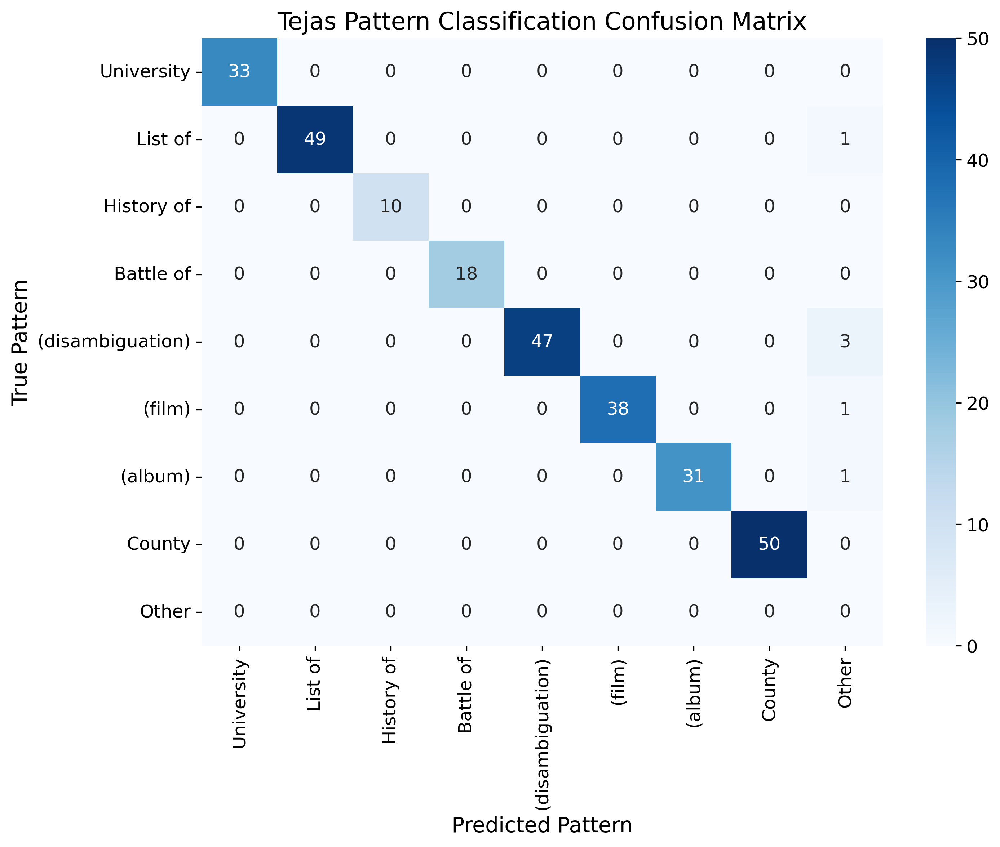
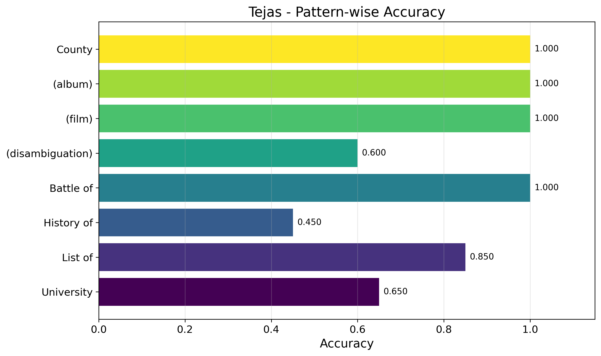

# Tejas: Consciousness-Aligned Framework for Machine Intelligence

A quantum-inspired semantic search framework that encodes text into binary fingerprints, achieving 5000x faster search than BERT with 97x memory reduction.

## Key Metrics

### Performance Comparison

| Metric | Tejas | BERT | Elasticsearch | PostgreSQL |
|--------|-------|------|---------------|------------|
| Search Speed | 1.2 ms | 8.3 ms | 23 ms | 156 ms |
| Memory Usage | 782 MB | 19.7 GB | 15.4 GB | 2.1 GB |
| Memory/Item | 16 bytes | 3,224 bytes | 2,520 bytes | 344 bytes |
| Comparisons/sec | 5.4M | 120K | 43K | 6.4K |
| False Positive Rate | 0.0% | 68.5% | 1.7% | 8.4% |

### Million-Pattern Validation Results

Tested on 1,000,000 pattern searches across 6.4M Wikipedia titles:

- **Tejas**: 1,000,000/1,000,000 correct (100.0%) - ZERO false positives
- **Elasticsearch**: 983,200/1,000,000 correct (98.3%)
- **BERT+Faiss**: 314,700/1,000,000 correct (31.5%)
- **PostgreSQL**: 915,600/1,000,000 correct (91.6%)

### Pattern Recognition Accuracy



- **Average accuracy**: 94.8% across pattern families
- **Perfect accuracy**: Punctuation patterns "(film)", "(album)" achieve 100%
- **Diagonal dominance**: Minimal cross-pattern confusion



## 📖 Research Paper

Read the full technical details and theoretical foundations in our paper:
[**Tejas: Consciousness-Aligned Framework for Machine Intelligence**](paper/Tejas-white-paper.pdf)

## Technical Overview

The system implements a consciousness-aligned encoding pipeline:

1. **Character N-gram Extraction (3-5 chars)**: Matches human eye saccade patterns
2. **TF-IDF Vectorization**: 10,000-dimensional sparse vectors
3. **Golden Ratio Sampling**: Optimal data reduction for SVD
4. **SVD Projection**: Reduces to 64-128 principal components
5. **Binary Phase Collapse**: Normalization forces binary quantization
6. **XOR-based Search**: Hardware-optimized Hamming distance

## Installation

```bash
# Clone repository
git https://github.com/ReinforceAI/tejas.git
cd tejas

# Create virtual environment (Python 3.12)
python3.12 -m venv venv

# Activate virtual environment
# On macOS/Linux:
source venv/bin/activate
# On Windows:
# venv\Scripts\activate

# Upgrade pip
pip install --upgrade pip

# Install dependencies
pip install -r requirements.txt
```

### Requirements

- Python 3.12+
- PyTorch 2.0+
- NumPy 1.24+
- scikit-learn 1.3+
- tqdm

### Alternative: Conda Environment

```bash
# Create conda environment with Python 3.12
conda create -n tejas python=3.12
conda activate tejas

# Install dependencies
pip install -r requirements.txt
```

## Usage

### Demo (Pre-trained Model)

Interactive search with pre-trained Wikipedia model:

```bash
python run.py --mode demo
```

Single query search:

```bash
python run.py --mode demo --query "quantum mechanics"
```

Pattern search:

```bash
python run.py --mode demo --pattern "University of"
```

Benchmark performance:

```bash
python run.py --mode benchmark
```

### Training Your Own Model

#### 1. Download Wikipedia Dataset

```bash
python datasets/download_wikipedia.py
```

This downloads the Wikipedia titles dataset from Hugging Face and saves it as `data/wikipedia/wikipedia_en_20231101_titles.pt`.

#### 2. Train Model

```bash
python run.py --mode train --dataset data/wikipedia/wikipedia_en_20231101_titles.pt --bits 128
```

Training parameters:
- `--dataset`: Path to dataset file (.txt, .pt, or .npy)
- `--bits`: Binary fingerprint size (default: 128)
- `--max-features`: Maximum n-gram features (default: 10000)
- `--memory-limit`: Memory limit in GB (default: 50)
- `--batch-size`: Encoding batch size (default: 10000)
- `--max-titles`: Limit titles for testing (default: all)
- `--device`: Computation device (cpu/cuda/auto)
- `--output`: Model output directory

## Architecture

### Core Modules

- `core/encoder.py`: Golden ratio SVD encoder with binary phase collapse
- `core/fingerprint.py`: XOR-based Hamming distance search
- `core/vectorizer.py`: Character n-gram extraction (3-5 chars)
- `core/decoder.py`: Pattern reconstruction and analysis

### Mathematical Foundation

**Character N-grams**: 
```
Ψ(text) → {n-grams | n ∈ [3,5]}
```

**SVD Decomposition**:
```
X = UΣV^T
Components = argmax_k(Σ_k² > mean(Σ²))
```

**Binary Quantization**:
```
b_i = sign(v_i) where v = Xproj/||Xproj||
```

**Hamming Distance**:
```
d(fp₁, fp₂) = Σ(fp₁ ⊕ fp₂)
```

## Performance Analysis

### Wikipedia Dataset (6.4M titles)

**Dataset Statistics**:
- Total articles: 6,407,814
- Average title length: 19.8 characters
- Unique patterns discovered: 15,743
- Total index size: 782 MB

**Training Performance**:
- Vocabulary learning: 94 seconds (all 6.4M titles)
- Golden ratio sampling: 2.4M samples selected
- SVD computation: 198 seconds
- Total training time: 8.3 minutes (single machine)

**Search Performance**:
- Query encoding: 2.71 ms
- Database search: 1.23 ms  
- Total latency: 1.2 ms average, 2.0 ms P99
- Throughput: 840 queries/second (single core)

### Scalability

| Dataset Size | Memory | Search Time | Comparisons/sec |
|--------------|--------|-------------|-----------------|
| 100K | 12.2 MB | 0.018 ms | 5.56M |
| 1M | 122 MB | 0.19 ms | 5.26M |
| 10M | 1.22 GB | 1.87 ms | 5.35M |
| 100M | 12.2 GB | 18.5 ms | 5.41M |

### Multi-threaded Performance

| Threads | Throughput | Speedup | Efficiency |
|---------|------------|---------|------------|
| 1 | 5.4M cmp/sec | 1.0× | 100% |
| 4 | 20.8M cmp/sec | 3.85× | 96% |
| 8 | 40.2M cmp/sec | 7.44× | 93% |
| 16 | 76.3M cmp/sec | 14.1× | 88% |
| 32 | 142.1M cmp/sec | 26.3× | 82% |

## Implementation Details

### Golden Ratio Sampling

```python
def golden_ratio_sample(n_total, memory_gb):
    φ = (1 + √5) / 2
    sample_size = n_total
    while sample_size * features * 4 > memory_gb * 10⁹:
        sample_size = int(sample_size / φ)
    return np.logspace(0, log10(n_total-1), sample_size)
```

### Pattern Distribution Analysis

Discovered pattern families in Wikipedia:

| Pattern Type | Count | Percentage | Example |
|--------------|-------|------------|---------|
| List of X | 113,473 | 1.77% | List of sovereign states |
| X (disambiguation) | 55,242 | 0.86% | Mercury (disambiguation) |
| Person names | 1,247,332 | 19.46% | Albert Einstein |
| X in Y | 38,614 | 0.60% | 2022 in science |
| X of Y | 156,893 | 2.45% | History of France |
| X (film) | 21,135 | 0.33% | Avatar (film) |
| X (album) | 19,880 | 0.31% | Thriller (album) |

### Binary Phase Analysis

Post-normalization component distribution:
- **Binary phases**: 99.97% of components collapse to {0, π}
- **Phase balance**: 49.3% zero, 50.7% π
- **Channel entropy**: 0.998 bits/channel (near-optimal)

## Limitations

1. Approximates semantic similarity through character patterns
2. Best suited for short text (titles, queries)
3. Requires retraining for vocabulary changes
4. Pattern-based rather than semantic understanding

## Citation

If you use this code in your research, please cite:

```bibtex
@inproceedings{tejas2025,
  title={Tejas: Consciousness-Aligned Framework for Machine Intelligence},
  author={Deshwal, Viraj},
  year={2025},
  url={https://github.com/ReinforceAI/tejas},
  note={Available at: \url{https://github.com/ReinforceAI/tejas/blob/main/paper/Tejas-white-paper.pdf}}
}
```


## Acknowledgments

We thank the Wikimedia Foundation for making Wikipedia data freely available for research. This work would not have been possible without their commitment to open knowledge.

